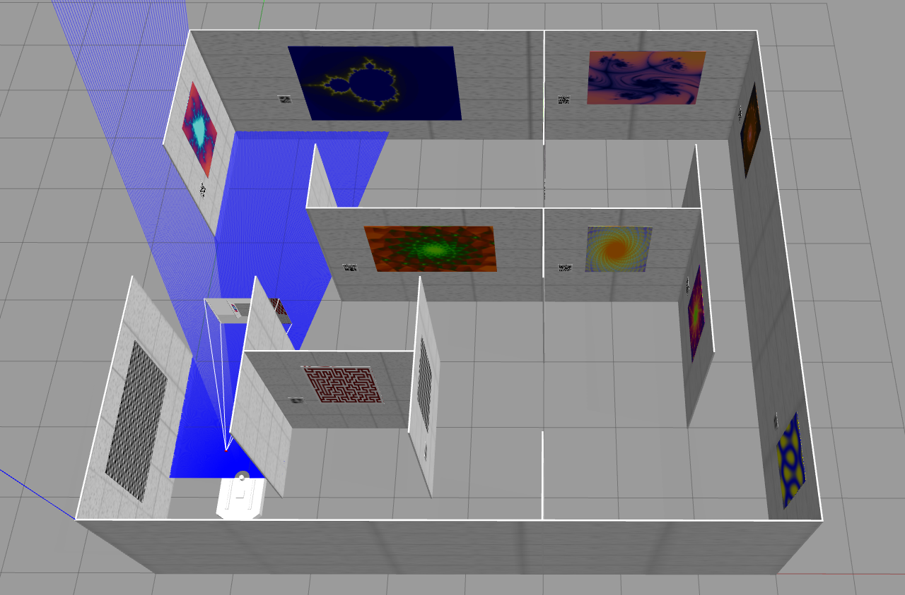
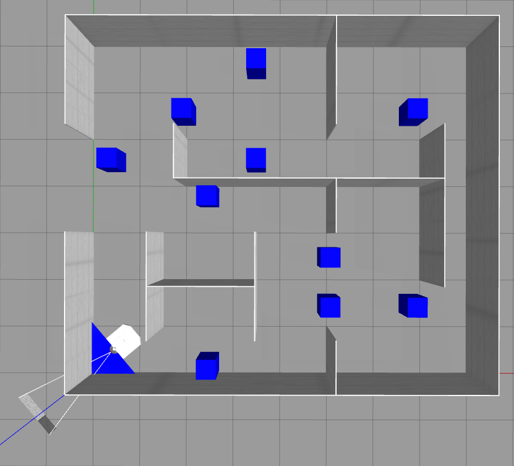
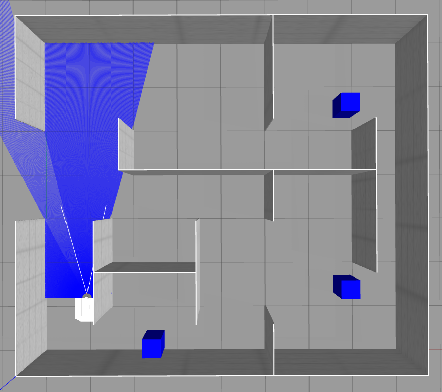

# Introducción
Este paquete contiene los ficheros necesarios para sinumar las tres pruebas de la final del SocialTech-Challenge.
Los tres ficheros launch que contiene el paquete sirven para lanzar cada una de las pruebas.
- **prueba1.launch** --> Aranca gazebo con el el escenario que se utilizará en la final de la competición.
- **prueba2.launch** --> Aranca gazebo con el el escenario que se utilizará en la final de la competición y coloca 3 obstaculos de forma aleatoria de entre las 10 posibles ubicaciones.
- **prueba3.launch** --> Aranca gazebo con el el escenario que se utilizará en la final de la competición y hace que un obstaculo recorra el escenario siguiendo una ruta fija.

Antes de ejecutar los escenarios recuerda hacer un source de ROS y del workspace en cada terminal que uses si es que no has introducido estos comandos en el bashrc.

    source /opt/ros/noetic/setup.bash
    source ~/SocialTech_ws/devel/setup.bash

Para no estar ejecutando estos dos comandos constantemente puedes ejecutar una vez los siguientes comandos:

    echo "source /opt/ros/noetic/setup.bash" >> ~/.bashrc
    echo "source ~/SocialTech_ws/devel/setup.bash" >> ~/.bashrc


# Ejecutar escenario de la prueba 1

Para arrancar el entrono que se utilizará en la prueba 1 ejecuta el siguiente comando:

    roslaunch SocialTech-Gazebo prueba1.launch 

Aparecerá una el simulador Gazebo tal y como aparece en la siguiente imagen.



Una vez arrancado en otra terminal se puede ejecutar el nodo de teleoperación para comprobar que todo funciona bien. Este nodo permite mover el AGV por el escenario utilizando el teclado.

    rosrun teleop_twist_keyboard teleop_twist_keyboard.py

# Ejecutar escenario de la prueba 2

Para arrancar el entrono que se utilizará en la prueba 1 ejecuta el siguiente comando:

    roslaunch SocialTech-Gazebo prueba2.launch 

Una vez arrancado en otra terminal se puede ejecutar el nodo de teleoperación para comprobar que todo funciona bien. Este nodo permite mover el AGV por el escenario utilizando el teclado.

    rosrun teleop_twist_keyboard teleop_twist_keyboard.py

Las 10 coordenadas de los posibles obstaculos se encuentran en el fichero ***config/puntosObstaculos.csv***. Tomando como origen de coordenadas la esquina inferior izquierda las coordenadas de los obstaculos son las siguientes:

| Punto | X | Y |
| ---- | ---- | ---- |
| 1 | 2.00 | 5.50 |
| 2 | 3.50 | 4.50 |
| 3 | 3.50 | 6.50 |
| 4 | 6.75 | 5.50 |
| 5 | 6.75 | 1.50 |
| 6 | 5.00 | 1.50 |
| 7 | 5.00 | 2.50 |
| 8 | 2.50 | 3.75 |
| 9 | 2.50 | 0.25 |
| 10 | 0.50 | 4.50 |

Como se pueden ver en la siguiente imagen.



En la prueba de obstaculos desconocidos se eligirán aleatoriamente 3 de las 10 posibles ubicaciones. Siendo un posible escenario el de la siguiente imagen.



# Ejecutar escenario de la prueba 3

Para arrancar el entrono que se utilizará en la prueba 1 ejecuta el siguiente comando:

    roslaunch SocialTech-Gazebo prueba3.launch 

Una vez arrancado en otra terminal se puede ejecutar el nodo de teleoperación para comprobar que todo funciona bien. Este nodo permite mover el AGV por el escenario utilizando el teclado.

    rosrun teleop_twist_keyboard teleop_twist_keyboard.py

Las coordenadas de la ruta que seguirá el objeto móvil se encuentran en el fichero ***config/puntos.csv***. T

Siendo la ruta la que se puede ver en la siguiente imagen.


# Cambiar la ubicación del lidar

Para cambiar la ubicación del lidar modificar el fichero ***urdf/lidar.xacro***.

```xml
    <?xml version="1.0"?>
    <robot xmlns:xacro="http://www.ros.org/wiki/xacro">
    <link name="rslidar_link">
        <visual>
        <origin xyz="0.0 0.0 0.0" />
        <geometry>
            <cylinder length="0.07" radius="0.03" />
        </geometry>
        <material name="orange" />
        </visual>
    </link>
    <joint name="rslidar_joint" type="fixed">
        <parent link="base_link" />
        <child link="rslidar_link" />
        <origin xyz="0.2125 0 0.20" rpy="0 0 0" />
    </joint>
    </robot>
```
Cambiar en la etiqueta origin dentro de la etiqueta joint el valor de la propiedad xyz.

# Cambiar la ubicación de la cámara

Para cambiar la ubicación del cámara modificar el fichero ***urdf/camera.xacro***.

```xml
    <?xml version="1.0"?>
    <robot xmlns:xacro="http://www.ros.org/wiki/xacro">
    <joint name="camera_joint" type="fixed">
        <parent link="base_link"/>
        <child link="camera_link"/>
        <origin xyz="0.305 0 0.2" rpy="0 0 0"/>
    </joint>

    <link name="camera_link">
        <visual>
            <geometry>
                <box size="0.010 0.03 0.03"/>
            </geometry>
            <material name="red"/>
        </visual>
    </link>

    <link name="camera_link_optical"></link>

    <joint name="camera_optical_joint" type="fixed">
        <origin xyz="0 0 0" rpy="-1.570796 0 -1.570796" />
        <parent link="camera_link" />
        <child link="camera_link_optical" />
    </joint>
    </robot>
```
Cambiar en la etiqueta origin dentro de la etiqueta joint el valor de la propiedad **xyz**, para cambiar la orientación cambiar la propiedad **rpy**.

# Cambiar parametros de la simulación

Por ejemplo, si se desea cambiar cuanto angulo abarca el lidar hay que modificar el fichero ***urdf/trace2.gazebo***, el valor **min_angle** y el valor **max_angle**.

```xml
 <gazebo reference="rslidar_link">
    <sensor type="ray" name="head_hokuyo_sensor">
      <pose>0 0 0 0 0 0</pose>
      <visualize>true</visualize>
      <update_rate>40</update_rate>
      <ray>
        <scan>
          <horizontal>
            <samples>720</samples>
            <resolution>1</resolution>
            <min_angle>-1.570796</min_angle>
            <max_angle>1.570796</max_angle>
          </horizontal>
        </scan>
        <range>
          <min>0.10</min>
          <max>30.0</max>
          <resolution>0.01</resolution>
        </range>
        <noise>
          <type>gaussian</type>
          <!-- Noise parameters based on published spec for Hokuyo laser
               achieving "+-30mm" accuracy at range < 10m.  A mean of 0.0m and
               stddev of 0.01m will put 99.7% of samples within 0.03m of the true
               reading. -->
          <mean>0.0</mean>
          <stddev>0.01</stddev>
        </noise>
      </ray>
      <plugin name="gazebo_ros_head_hokuyo_controller" filename="libgazebo_ros_laser.so">
        <topicName>/scan</topicName>
        <frameName>rslidar_link</frameName>
      </plugin>
    </sensor>
  </gazebo>
  ```